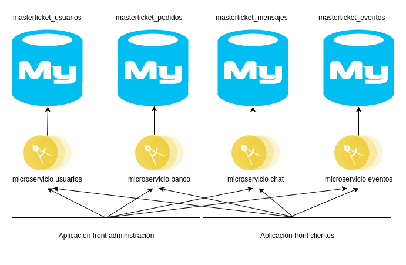

# Masterticket microservicios

Instrucciones:

Crear las bases de datos:
* masterticket_usuarios
* masterticket_eventos
* masterticket_pedidos
* masterticket_mensajes

Posteriormente hacer:
* mysql -u root -p masterticket_usuarios < masterticket_usuarios.sql
* mysql -u root -p masterticket_eventos < masterticket_eventos.sql
* mysql -u root -p masterticket_pedidos < masterticket_pedidos.sql
* mysql -u root -p masterticket_mensajes < masterticket_mensajes.sql

